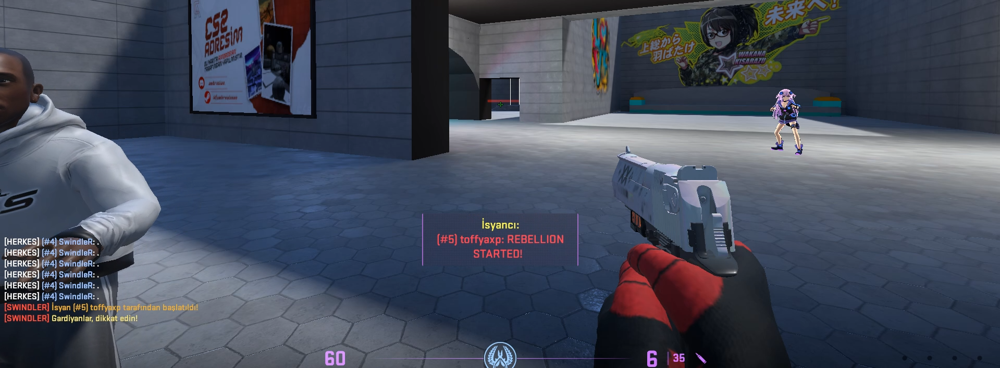

# 🔫 CS2 Plugin - [Rebellion Sound Plugin]

## Discord: https://discord.gg/YmaDNa8kjw

---

## 📌 Description

This plugin is a custom extension developed for Counter-Strike 2 servers. It offers the following features:

---

- ✅ This plugin works in Jailbreak modes.
- ✅ At the beginning of each round, if any prisoner lands the first hit on a guard, a riot sound will play for everyone.
- ✅ At the same time, a message like "[Player Name] has triggered a riot, the Riot has begun!" will appear in the chat and in the center of the screen.
- ✅ You can change the music and other settings from the config options.

---

## 🧩 Requirements

- Counter-Strike 2 (dedicated server)
- CounterStrikeSharp

---

## 🛠️ Installation

### 1) Download the Plugin

- Download the latest release from:  
 👉 [Releases](https://github.com/SwindleR-b/CS2-Rebellion-Sound/releases)

### 2) Install the Plugin

Place the plugin in the following directory:

_cs2/addons/counterstrikesharp/plugins/_

### 3) Start / Reload the Plugin

To activate:

- Restart your server  
  **OR**
- Run the following command in the server console:
css_plugins load JailbreakRebellion

---

## 📁 Configuration File
After restarting your server, a configuration file will be automatically generated at:

_cs2/addons/counterstrikesharp/config/plugins/JailbreakRebellion/JailbreakRebellion.json _

- You can use this config setting to replace the in-game sound with another sound. You can even add a sound you've downloaded from the workshop (e.g., `sound/xxx/xxx.wav`). Additionally, you can customize settings such as ChatTag, color options, HUD message display duration, and more.

---

## 📸 Screenshots

Here are some in-game screenshots of the plugin in action:

  

---

## 🎥 Video

Here are some in-game video of the plugin in action:

  

